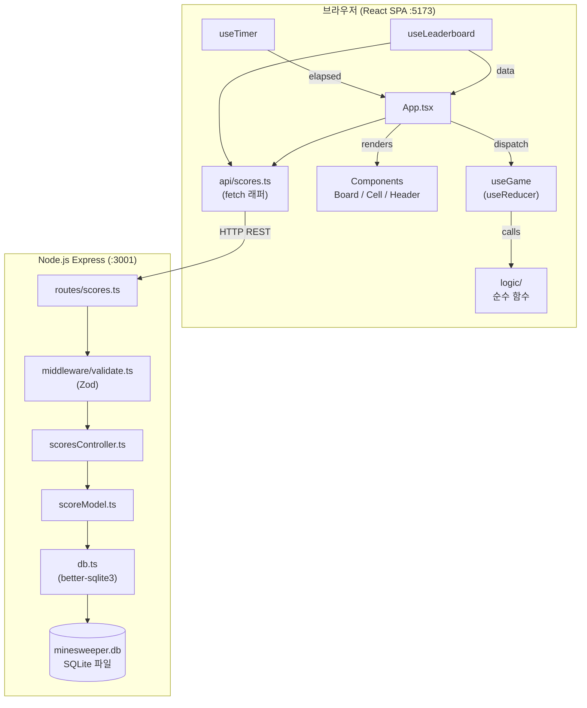
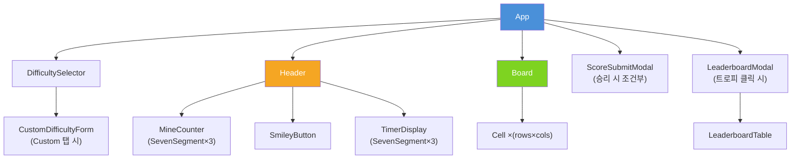
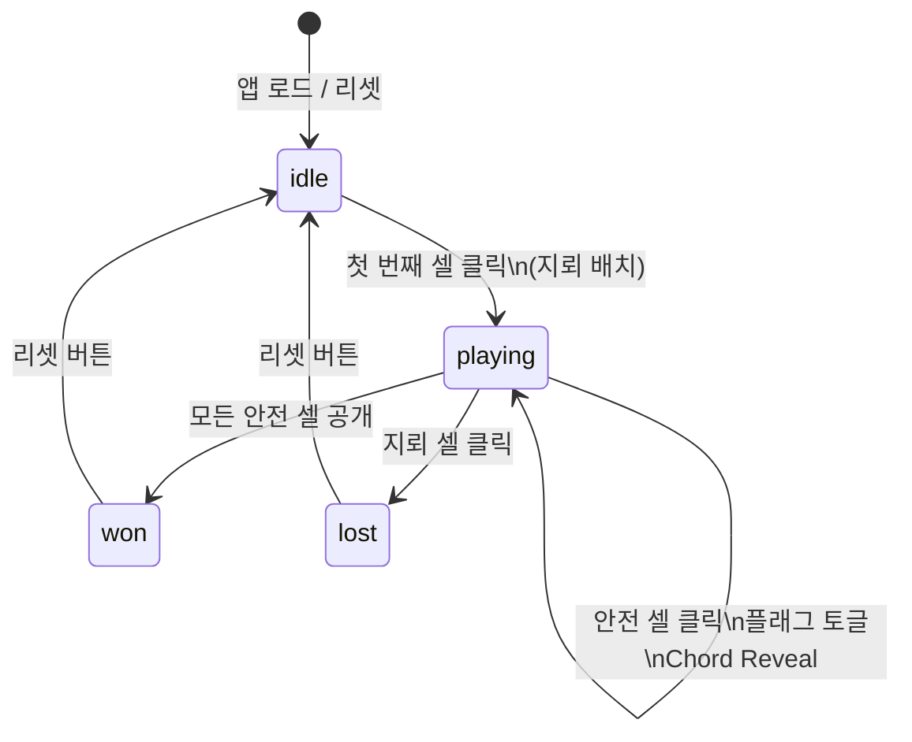
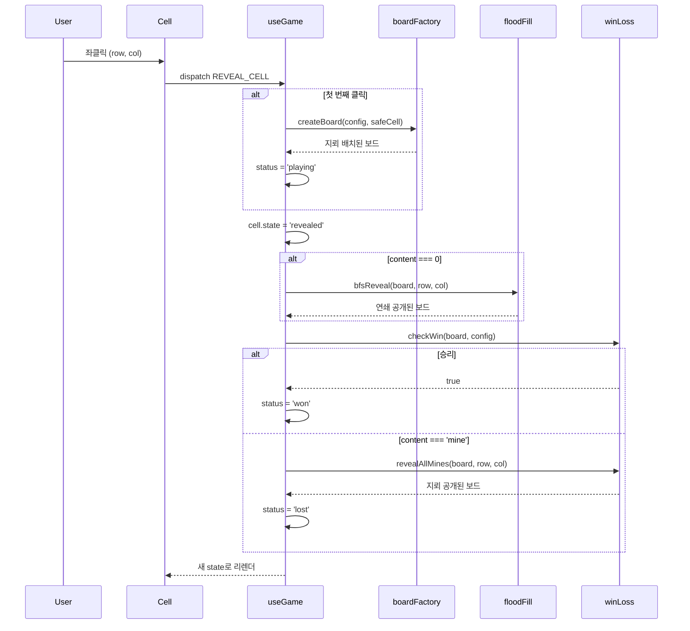
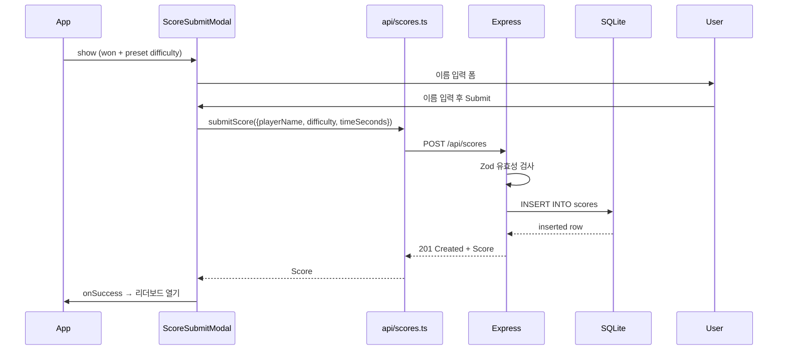

# 기술 아키텍처 다이어그램 (Architecture Diagram)

## 1. 시스템 전체 구조

```
┌──────────────────────────────────────────────────────────────────┐
│                          Browser                                 │
│                                                                  │
│  ┌────────────────────────────────────────────────────────────┐  │
│  │           React SPA  (Vite Dev Server :5173)               │  │
│  │                                                            │  │
│  │  ┌──────────┐   dispatch   ┌──────────────────────────┐   │  │
│  │  │  App.tsx │ ──────────▶  │  useGame (useReducer)    │   │  │
│  │  └────┬─────┘              └────────────┬─────────────┘   │  │
│  │       │ renders                         │ calls           │  │
│  │  ┌────▼──────────────────┐   ┌──────────▼──────────────┐  │  │
│  │  │  Components           │   │  logic/ (순수 함수)      │  │  │
│  │  │  ├─ Board             │   │  ├─ boardFactory.ts     │  │  │
│  │  │  │   └─ Cell ×(r×c)  │   │  ├─ floodFill.ts        │  │  │
│  │  │  ├─ Header            │   │  ├─ gameActions.ts      │  │  │
│  │  │  │   ├─ MineCounter   │   │  └─ winLoss.ts          │  │  │
│  │  │  │   ├─ SmileyButton  │   └─────────────────────────┘  │  │
│  │  │  │   └─ TimerDisplay  │                                 │  │
│  │  │  ├─ DifficultySelector│   ┌─────────────────────────┐  │  │
│  │  │  ├─ ScoreSubmitModal  │   │  useTimer               │  │  │
│  │  │  └─ LeaderboardModal  │   │  useLeaderboard         │  │  │
│  │  └───────────────────────┘   └──────────┬──────────────┘  │  │
│  │                                         │ fetch           │  │
│  │  ┌──────────────────────────────────┐   │                 │  │
│  │  │  api/scores.ts (fetch wrapper)   │◀──┘                 │  │
│  │  └──────────────────────┬───────────┘                     │  │
│  └─────────────────────────┼───────────────────────────────── ┘  │
└────────────────────────────┼─────────────────────────────────────┘
                             │ HTTP REST (JSON)
                             │ /api/scores
                             ▼
┌──────────────────────────────────────────────────────────────────┐
│              Node.js / Express  (:3001)                          │
│                                                                  │
│  routes/scores.ts                                                │
│         │                                                        │
│  middleware/validate.ts  (Zod 검증)                              │
│         │                                                        │
│  controllers/scoresController.ts                                 │
│         │                                                        │
│  models/scoreModel.ts  (DB 쿼리)                                 │
│         │                                                        │
│  db.ts  (better-sqlite3 싱글톤)                                  │
│         │                                                        │
│  backend/data/minesweeper.db  (SQLite 파일)                      │
└──────────────────────────────────────────────────────────────────┘
```

---

## 2. Mermaid 다이어그램

### 2.1 시스템 아키텍처



### 2.2 React 컴포넌트 트리



### 2.3 게임 상태 머신



### 2.4 REVEAL_CELL 액션 처리 흐름



### 2.5 점수 제출 시퀀스



---

## 3. 데이터 흐름 요약

| 방향 | 경로 | 형식 |
|---|---|---|
| 사용자 입력 → 상태 | User → Cell → useGame dispatch → GameState | React Event |
| 상태 → UI | GameState → Board/Header/Cell props | React render |
| 프론트 → 백엔드 | api/scores.ts → POST /api/scores | JSON over HTTP |
| 백엔드 → DB | scoreModel.ts → better-sqlite3 | SQLite |
| 백엔드 → 프론트 | Express → JSON response | JSON over HTTP |

---

## 4. 배포 아키텍처 (프로덕션)

```
Internet
    │
    ▼
Reverse Proxy (Nginx / Caddy)
    ├─ /* ────────────────▶ Static Files (frontend/dist/)
    └─ /api/* ────────────▶ Node.js Express (:3001)
                                    │
                            minesweeper.db (volume)
```
