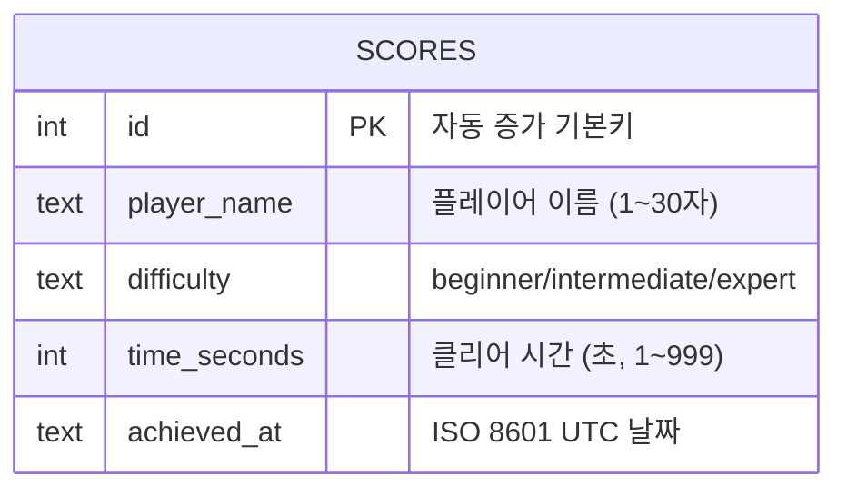

# ERD (Entity Relationship Diagram)

## 1. 개요

지뢰찾기 게임의 데이터베이스는 리더보드 기능을 위한 단일 테이블로 구성된다. 게임 로직 자체는 서버리스(클라이언트 메모리)로 동작하므로 별도 게임 상태 저장이 필요 없다.

---

## 2. 테이블: scores

플레이어의 클리어 기록을 저장하는 테이블.

### 컬럼 정의

| 컬럼명 | 타입 | 제약 | 설명 |
|---|---|---|---|
| `id` | INTEGER | PK, AUTOINCREMENT | 자동 증가 기본키 |
| `player_name` | TEXT | NOT NULL, 1≤len≤30 | 플레이어 이름 |
| `difficulty` | TEXT | NOT NULL, ENUM | 난이도 ('beginner'/'intermediate'/'expert') |
| `time_seconds` | INTEGER | NOT NULL, 1≤val≤999 | 클리어 시간 (초) |
| `achieved_at` | TEXT | NOT NULL, DEFAULT UTC | ISO 8601 형식 날짜 (예: `2026-04-29T10:00:00Z`) |

### 제약 조건

```sql
CHECK(difficulty IN ('beginner', 'intermediate', 'expert'))
CHECK(time_seconds > 0 AND time_seconds <= 999)
CHECK(length(player_name) >= 1 AND length(player_name) <= 30)
```

### 인덱스

```sql
CREATE INDEX idx_scores_difficulty_time ON scores(difficulty, time_seconds ASC);
```
`GET /api/scores?difficulty=beginner&limit=10` 쿼리 최적화를 위해 (difficulty, time_seconds) 복합 인덱스 사용.

---

## 3. Mermaid ERD



---

## 4. 데이터 예시

```sql
INSERT INTO scores (player_name, difficulty, time_seconds) VALUES
    ('Alice',  'beginner',     87),
    ('Bob',    'beginner',    102),
    ('Carol',  'intermediate', 234),
    ('Dave',   'expert',       412),
    ('Eve',    'beginner',      65);
```

결과:

| id | player_name | difficulty | time_seconds | achieved_at |
|---|---|---|---|---|
| 1 | Alice | beginner | 87 | 2026-04-29T10:00:00Z |
| 2 | Bob | beginner | 102 | 2026-04-29T10:05:00Z |
| 3 | Carol | intermediate | 234 | 2026-04-29T11:00:00Z |
| 4 | Dave | expert | 412 | 2026-04-29T12:00:00Z |
| 5 | Eve | beginner | 65 | 2026-04-29T13:00:00Z |

---

## 5. 주요 쿼리

### 리더보드 조회 (초급 상위 10)

```sql
SELECT id, player_name, difficulty, time_seconds, achieved_at
FROM scores
WHERE difficulty = 'beginner'
ORDER BY time_seconds ASC
LIMIT 10;
```

### 점수 삽입

```sql
INSERT INTO scores (player_name, difficulty, time_seconds)
VALUES (?, ?, ?);
```

---

## 6. 확장 고려사항

현재 구조는 최소 요구사항을 충족하는 단순한 설계다. 향후 확장 시:

- **사용자 인증 추가**: `users` 테이블 추가, `scores.user_id FK` 연결
- **게임 세션 저장**: `games` 테이블 (board_config, status, duration 등)
- **통계**: `scores`에 집계 뷰(View) 추가
